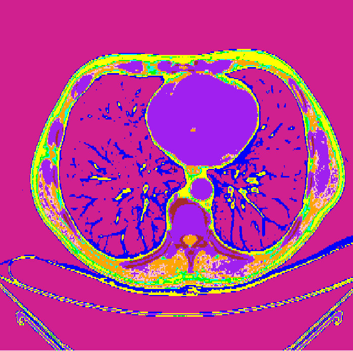

# ct2mcnp
Conversion of DICOM CT inputs into formats compatible with MCNP:

# Load 
Load the `scan.py` and `ct2mcnp.py` files into your directory (`/home/your_path_directory`).

# Compilation

1) Import the `Ct2mcnp` library.
2) Define your DICOM CT path in the variable `path1`.
   
   The names of DICOM CT files must begin with CT (e.g., CT_myct.dcm) and do not need to be sorted.
4) Define your output MCNP file in `path2`.
5) Define the position of your CT matrix in the MCNP geometry by `transX`, `transY`, and `transZ`.

   `transX`, `transY`, and `transZ` represent the displacement of the corners of the CTs cube.

# Example
from ct2mcnp import Ct2mcnp

path1 = "/home/examples/Patient/Abdomen/"

path2 = "/home/mcnp/mcnp.m"

transX = 0

transY = 0

transZ = 0

Ct2mcnp(path1, path2, transX, transY, transZ).cell_card()

# Update
You can update the `ct2mcnp.py` file by defining your own materials and density intervals specific to your scanner.

